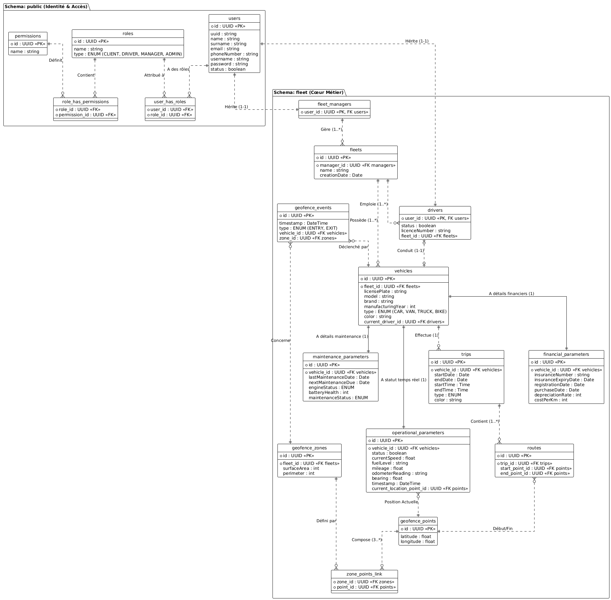

# 🗄️ Documentation du Modèle Physique de Données (MPD)

**Projet :** Fleet Management & Geofencing System (TransEns)
**Date :** 18 Janvier 2026
**Version :** 1.0 (Validée)

---

## 1. Organisation Globale

La base de données est structurée en deux schémas distincts pour séparer les données transverses (Authentification) des données métier.

### 🔹 Schéma `public` (Identité & Accès)
Ce schéma contient les données partagées par l'écosystème TransEns. Il est principalement géré par le service d'Authentification externe, mais nous maintenons une copie locale pour l'intégrité référentielle.

*   **`users`** : Table mère contenant les identifiants (UUID), noms, emails et mots de passe.
*   **`roles` / `permissions`** : Gestion des droits d'accès (RBAC).

### 🔹 Schéma `fleet` (Cœur de Métier)
Ce schéma contient toutes les tables spécifiques à la gestion de flotte.

---

## 2. Description des Tables (Schéma `fleet`)

### 2.1. Les Acteurs
Ces tables étendent la table `public.users` (Héritage de données).

| Table | Description | Clé Primaire / Étrangère |
| :--- | :--- | :--- |
| **`fleet_managers`** | Profil métier du gestionnaire. Contient les infos d'entreprise et d'abonnement. | PK/FK : `user_id` (ref `users`) |
| **`drivers`** | Profil métier du chauffeur. Contient le permis et le statut d'activité. | PK/FK : `user_id` (ref `users`)   FK : `fleet_id` |

### 2.2. Organisation de la Flotte

| Table | Description | Relations |
| :--- | :--- | :--- |
| **`fleets`** | Représente une entité flotte (entreprise de transport). | FK : `manager_id` (Un manager gère une ou plusieurs flottes). |

### 2.3. Gestion des Véhicules
Le véhicule est une entité centrale composée de plusieurs tables pour séparer les responsabilités.

| Table | Description | Relations |
| :--- | :--- | :--- |
| **`vehicles`** | Table pivot. Contient les infos d'identification (Plaque, Marque, Modèle) et l'état d'assignation. | FK : `fleet_id` FK : `current_driver_id` (Relation 1-1 temporaire) |
| **`financial_parameters`** | Données financières (Assurance, Coût/km, Achat). | FK : `vehicle_id` (1-1) |
| **`maintenance_parameters`** | État de santé (Moteur, Batterie, Dates de révision). | FK : `vehicle_id` (1-1) |
| **`operational_parameters`** | Données temps réel (Vitesse, Carburant, Kilométrage). | FK : `vehicle_id` (1-1) FK : `current_location_point_id` |

### 2.4. Trajets et Géométrie

| Table | Description | Relations |
| :--- | :--- | :--- |
| **`trips`** | Enregistrement d'une course (Début, Fin, Statut). | FK : `vehicle_id`, `driver_id` |
| **`routes`** | Composition d'un trajet. Relie un trajet à ses points clés. | FK : `trip_id`, `start_point_id`, `end_point_id` |
| **`geofence_points`** | Coordonnées GPS brutes (Latitude, Longitude). | Utilisé par `routes` et `operational_parameters`. |

### 2.5. Geofencing (Zones et Alertes)

| Table | Description | Relations |
| :--- | :--- | :--- |
| **`geofence_zones`** | Définition des zones surveillées (Nom, Superficie). | FK : `fleet_id` |
| **`zone_points_link`** | Table de liaison pour construire la géométrie des zones (Polygone). | FK : `zone_id`, `point_id` |
| **`geofence_events`** | Historique des entrées/sorties de zone (Alertes). | FK : `vehicle_id`, `zone_id` |

---

## 3. Diagramme Relationnel (Visuel)

Voici la représentation visuelle du modèle validé :

